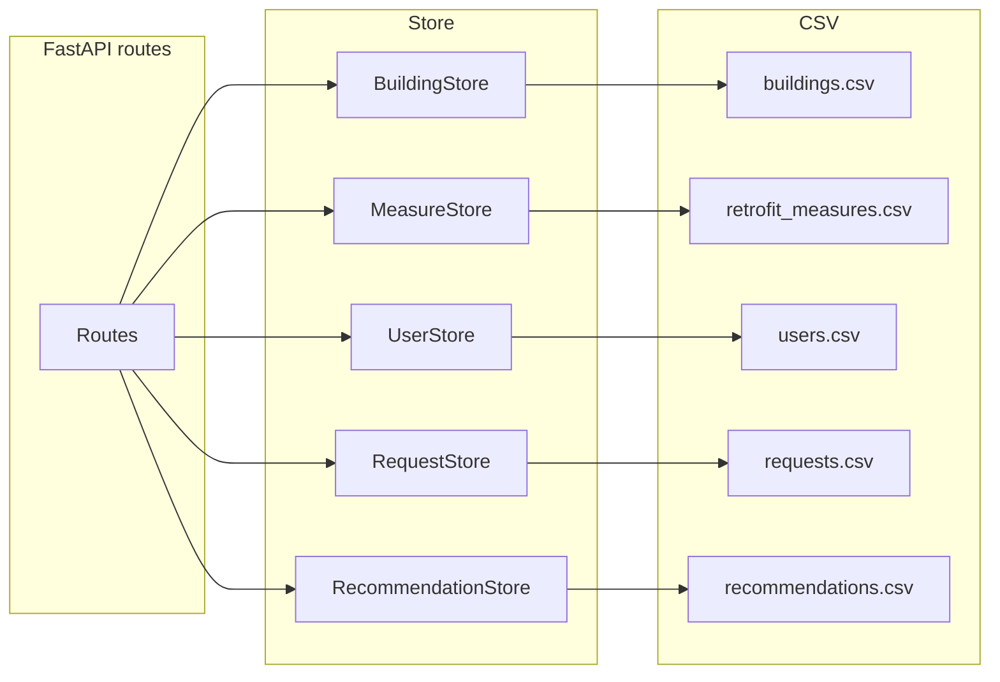

# План: Eco — бэкенд, хранение, интеграция с фронтом

Основа: исходники в [.cursor/plans/eco_backend_api_sources/](.cursor/plans/eco_backend_api_sources/) (00–10). Язык кода, комментариев и UI — английский.

---

## Ключевые решения (из [01_intro_decisions.md](.cursor/plans/eco_backend_api_sources/01_intro_decisions.md))

- **Данные зданий:** только [data/buildings.csv](data/buildings.csv), загрузка в память при старте; внешние API (ETHOS) не используются.
- **Хранение:** только CSV. Здания и меры — в памяти из `buildings.csv` и [data/retrofit_measures.csv](data/retrofit_measures.csv); пользователи, заявки, рекомендации — в `data/users.csv`, `data/requests.csv`, `data/recommendations.csv`. Доступ через слой **Store**.
- **Адрес в API:** один slug в path (например `12557-luisenstr-33`). Выбор адреса — каскад: индекс → улицы (из buildings) → номера домов → `building_id` / `address_slug`.
- **Заявки:** одна запись на пользователя (user_id, building_id, status). Координаты — только lat/lon в полях, без PostGIS.
- **«Соседи»:** на MVP только лог в консоль; реальная почта — позже.
- **Фаза UI:** MVP по макету [Eco UI (Figma)](https://www.figma.com/design/moChaqh8shWNCiTzTCVhBA/Untitled--Copy-?node-id=0-1): ViabCheck, визард 4 шагов, градиент, подключение к FastAPI.

### Уточнённые решения (по результатам вопросов)

- **address_slug:** собирать из трёх полей: `postal_code` + `street` + `house_num` (нормализация: нижний регистр, пробелы → дефис, ü→ue, ö→oe, ä→ae). Пример: `10317-landsberger-allee-36`.
- **Ответы поиска/каскада:** поле `id` в ответе равно `building_id` (дублировать для совместимости).
- **Заявки:** при `create_or_update` с новым `building_id` для того же пользователя — перезаписывать существующую запись (одна запись на user_id).
- **Аутентификация MVP:** без auth; клиент передаёт `user_id` в body/query там, где нужно (PATCH /api/users/:id, GET /api/requests?user_id=…).
- **Калькулятор — стоимость меры (порог 900 €):** если `typical_cost_eur_m2` < 900 — умножаем на площадь: `typical_cost_eur_m2 × total_area_m2 × factor`. Если ≥ 900 — считаем как разовые расходы на всю квартиру/здание (без умножения на площадь).
- **Рекомендации:** при новом POST /api/ai-recommendations для здания — дописывать новую строку в recommendations.csv (история); `get_by_building(building_id)` возвращает последнюю запись.
- **Фронтенд:** дизайн из Figma, код — интеграция из Codex в текущий проект (frontend/).

---

## 1. Хранение: слой Store и CSV ([03_storage.md](.cursor/plans/eco_backend_api_sources/03_storage.md))

Маршруты FastAPI работают только с абстракциями Store; реализации — чтение/запись CSV и память.

**Интерфейсы Store:**

- **BuildingStore:** загрузка [data/buildings.csv](data/buildings.csv) в память при старте; `address_slug` = нормализованная склейка `postal_code` + `street` + `house_num` (см. Уточнённые решения). Методы: `get_by_slug(slug)`, `search(query, limit)`, `get_streets_by_postal_code(postal_code)`, `list_by_postal_code_and_street(postal_code, street)`. Ответы каскада/поиска: `{ id, building_id, address_slug, display_address, latitude, longitude }` где `id` = `building_id`. Маппинг строк CSV — по единой схеме здания (реализовать или вынести в `cursor_scripts/unified_building_schema.py`).
- **MeasureStore:** `list_all()`, при необходимости `get_by_id(measure_id)` — из [data/retrofit_measures.csv](data/retrofit_measures.csv) в памяти.
- **UserStore:** `create(...)`, `get_by_id(id)`, `get_by_building_id(building_id)`, `update(id, ...)` — [data/users.csv](data/users.csv).
- **RequestStore:** `create_or_update(user_id, building_id, status)` — одна запись на пользователя; при повторном вызове с другим building_id перезаписывать запись. `get_by_user(user_id)`, `list_by_building(building_id)` — [data/requests.csv](data/requests.csv).
- **RecommendationStore:** `save(building_id, payload, ...)` — дописывать строку (история); `get_by_building(building_id)` возвращает последнюю запись по building_id. [data/recommendations.csv](data/recommendations.csv), payload — JSON-строка.

**Форматы CSV:**

- **buildings / retrofit_measures** — существующие файлы без изменений.
- **users.csv (новый):** id, name, email, building_id, subscription_status, warmmiete, kaltmiete, apartment_area_m2, profile_updated_at, created_at.
- **requests.csv (новый):** id, user_id, building_id, status, created_at, updated_at.
- **recommendations.csv (новый):** building_id, payload (JSON), estimated_cost, monthly_savings, created_at.

**Детали:** id — UUID или инкремент; запись = прочитать файл → изменить в памяти → записать; при необходимости блокировка/запись во временный файл и rename; один процесс, без транзакций и нескольких воркеров.

---

## 2. Загрузка при старте ([05_import.md](.cursor/plans/eco_backend_api_sources/05_import.md))

Отдельный скрипт импорта не нужен. При старте приложения загружать в память [data/buildings.csv](data/buildings.csv) и [data/retrofit_measures.csv](data/retrofit_measures.csv), строить `address_slug` из postal_code + street + house_num (нормализация: см. Уточнённые решения; при наличии — через общую функцию типа `build_address_key`).

---

## 3. Backend (FastAPI) ([04_backend.md](.cursor/plans/eco_backend_api_sources/04_backend.md))

Все секреты (OpenAI и др.) — из `.env`.

- **GET /api/building/:address** — address = slug; BuildingStore.get_by_slug; 404 если нет.
- **GET /api/buildings/search** — query, limit; BuildingStore.search; ответ — список `{ id, building_id, address_slug, display_address, latitude, longitude }`.
- **Каскад адреса:** **GET /api/buildings/streets?postal_code=…** — уникальные улицы по индексу; **GET /api/buildings?postal_code=…&street=…** — здания (номера домов); тот же формат ответа.
- **GET /api/building/:address/calculator** (или GET /api/calculator?address_slug=…) — здание + применимые меры с расчётами (см. раздел 4).
- **POST /api/users** — регистрация: name, email, building_id; опционально warmmiete, kaltmiete, apartment_area_m2. После создания — если по building_id уже > 1 пользователь — логировать «письмо соседям».
- **PATCH /api/users/:id** (или PUT) — обновление профиля (warmmiete, kaltmiete, apartment_area_m2), обновлять profile_updated_at.
- **POST /api/requests**, **GET /api/requests** — создание/обновление заявки по user_id/building_id (при смене здания — перезапись); GET с query user_id или building_id. Без auth: клиент передаёт user_id в query/body.
- **POST /api/ai-recommendations** — тело: building_id или данные здания; BuildingStore + подбор применимых мер (логика калькулятора); промпт ИИ: 3 DIY (≈100/200/300€) + 3 капитальных только из списка; сохранение через RecommendationStore (payload JSON), возврат клиенту.

---

## 4. Калькулятор мер ([06_calculator.md](.cursor/plans/eco_backend_api_sources/06_calculator.md))

**Вход:** slug или building_id → BuildingStore. **Подбор мер:** MeasureStore + фильтр по prerequisites и уже выполненным (insulation_roof, window_type и т.д.). **Расчёты:** по формулам вкладки Calculator в [data/mock_data_combo.xlsx](data/mock_data_combo.xlsx); данные из CSV, не из xlsx.

- **Стоимость меры (порог 900 €):** если `typical_cost_eur_m2` < 900 — `typical_cost_eur_m2 × total_area_m2 × factor` (factor — конфиг, в таблице 0.14); если ≥ 900 — разовые расходы на всю квартиру/здание, без умножения на площадь (значение из CSV как фиксированная сумма).
- Субсидия: 60% от стоимости (конфиг).
- Годовое потребление: по [data/energy_consumption.csv](data/energy_consumption.csv) (сумма heating_kwh за 12 мес. по building_id) или fallback `energy_consumption_kwh_m2 × total_area_m2`; экономия €/год и payback_years = cost / annual_benefit.
- Константы (factor, доля субсидии, цена тепла) — в конфиге приложения или .env.

**Выход API:** здание + массив мер: measure_id, measure_name, category, estimated_cost, subsidy_eur/subsidy_pct, estimated_savings_eur_per_year, payback_years (опционально), estimated_savings_pct, subsidy_info, **requires_whole_building_landlord**. Для Envelope/Heating/District heating — по умолчанию requires_whole_building_landlord = true; для DIY/квартирных — false. Опционально: user_id или apartment_area_m2 для персонального расчёта.

---

## 5. AI-рекомендации ([07_ai.md](.cursor/plans/eco_backend_api_sources/07_ai.md))

Источник мер — только [data/retrofit_measures.csv](data/retrofit_measures.csv) (MeasureStore). Вход: здание + уже отфильтрованный список применимых мер (как в калькуляторе). Промпт: выбрать 3 DIY (≈100/200/300€) и 3 капитальных/общедомовых только из списка; для общедомовых — формулировка «для всего здания с привлечением арендодателя». Выход: сохранять в RecommendationStore (payload JSON: diy_measures, whole_building_measures с measure_id, measure_name, estimated_cost_eur, expected_savings_pct, note_landlord_if_applicable); при необходимости — текстовое резюме в том же JSON.

---

## 6. UI — фронтенд по Figma, MVP ([02_phase_mvp.md](.cursor/plans/eco_backend_api_sources/02_phase_mvp.md), [08_ui.md](.cursor/plans/eco_backend_api_sources/08_ui.md))

**Источник:** [Eco UI — Figma](https://www.figma.com/design/moChaqh8shWNCiTzTCVhBA/Untitled--Copy-?node-id=0-1). Реализация: интеграция кода из Codex в `frontend/`; при вёрстке — Figma MCP для соответствия компонентам, отступам, типографике.

- **Бренд:** ViabCheck (Söhne Breit), слоган «Figure out how to finance insulating your building without losing money.» Фон: градиент 142°, #FF5005 → белый; текст чёрный, кнопки — чёрная заливка, белый текст.
- **Визард 4 шага:** степпер 1–2–3–4; активный — чёрная заливка с белой цифрой, неактивные — контур с оранжевой заливкой.
- **Шаг 1 — Where do you live:** Postcode → GET /api/buildings/streets → Street; Street → GET /api/buildings?postal_code&street=… → Number; City из здания или редактирование. Поля: полупрозрачный белый фон, обводка 1px; кнопка Next (таблетка).
- **Шаг 2 — Define retrofits needed:** Address (с шага 1), Building Details (GET /api/building/:address), Apartment Details / Kaltmiete (профиль/здание).
- **Шаг 3 — Retrofit suggestion:** данные GET /api/building/:address/calculator; раздельно DIY и меры для всего здания (requires_whole_building_landlord); при необходимости POST /api/ai-recommendations; блок «we get» (construction year, refurbishment state, yearly heat demand).
- **Шаг 4:** уточнить по макету (регистрация/заявка или итог).

Фронт — тонкий клиент к FastAPI: только формы и отображение ответов API. Контракт API зафиксировать (OpenAPI).

---

## 7. Порядок реализации ([09_order.md](.cursor/plans/eco_backend_api_sources/09_order.md))

1. **CSV и Store:** структура users/requests/recommendations; интерфейсы Store и CSV-реализации; загрузка buildings и retrofit_measures в память при старте, расчёт address_slug; при необходимости — модуль нормализации адреса (например в `cursor_scripts` или в коде приложения).
2. **FastAPI (здания):** GET /api/building/:address, GET /api/buildings/search, GET /api/buildings/streets, GET /api/buildings?postal_code&street=.
3. **Пользователи:** POST /api/users, PATCH /api/users/:id, логика «соседи» (лог при count > 1 по building_id).
4. **Калькулятор:** GET /api/building/:address/calculator — подбор мер, расчёты по формулам из xlsx, конфиг констант.
5. **AI:** POST /api/ai-recommendations — применимые меры + промпт, сохранение в RecommendationStore.
6. **Заявки:** POST /api/requests, GET /api/requests.
7. **MVP фронтенд:** экраны по Figma (frontend/), визард 4 шагов, вызовы всех эндпоинтов, OpenAPI.

---

## Открытые моменты ([10_open.md](.cursor/plans/eco_backend_api_sources/10_open.md))

- **Шаг 4 визарда:** уточнить по макету Figma (регистрация/заявка или итоговый экран).
