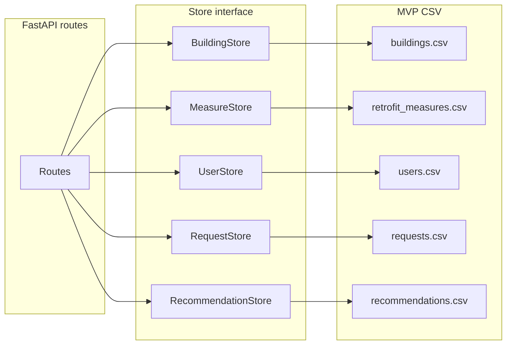

## 1. Хранение данных: только CSV

Все данные хранятся в CSV; слой доступа абстрагирован за интерфейсами Store.

### 1.1 Слой Store (абстракция)

Маршруты FastAPI работают только с Store; реализации читают/пишут CSV и память.

- **BuildingStore:** `get_by_slug(slug)`, `search(query, limit)` — данные из загруженного в память списка/DataFrame из [data/buildings.csv](data/buildings.csv); `address_slug` вычислять при загрузке (нормализация postal_code + address через [unified_building_schema.py](cursor_scripts/unified_building_schema.py)). Для каскадного выбора адреса: `get_streets_by_postal_code(postal_code)` — список уникальных улиц (из поля address или street) для данного индекса; `list_by_postal_code_and_street(postal_code, street)` — список зданий (номера домов) для пары индекс+улица, ответ в том же формате, что и search (id, building_id, address_slug, display_address, latitude, longitude).
- **MeasureStore:** `list_all()`, при необходимости `get_by_id(measure_id)` — из [data/retrofit_measures.csv](data/retrofit_measures.csv) в памяти.
- **UserStore:** `create(...)`, `get_by_id(id)`, `get_by_building_id(building_id)`, `update(id, ...)` — чтение/запись [data/users.csv](data/users.csv).
- **RequestStore:** `create_or_update(user_id, building_id, status)`, `get_by_user(user_id)`, `list_by_building(building_id)` — [data/requests.csv](data/requests.csv).
- **RecommendationStore:** `save(building_id, payload, ...)`, `get_by_building(building_id)` — [data/recommendations.csv](data/recommendations.csv) (payload — JSON-строка в колонке).

### 1.2 Форматы CSV

**buildings** — существующий [data/buildings.csv](data/buildings.csv) (без изменений). Поля: building_id, district, postal_code, address, latitude, longitude, construction_year, building_type, num_units, total_area_m2, roof_type, window_type, insulation_walls, insulation_roof, insulation_basement, epc_rating, energy_consumption_kwh_m2 и др. Маппинг — [unified_building_schema.py](cursor_scripts/unified_building_schema.py) `buildings_csv_row_to_unified`. `address_slug` не хранить, вычислять при загрузке.

**retrofit_measures** — существующий [data/retrofit_measures.csv](data/retrofit_measures.csv) (без изменений).

**users** — новый файл **data/users.csv**: id, name, email, building_id, subscription_status, warmmiete, kaltmiete, apartment_area_m2, profile_updated_at, created_at. Создание = дописать строку; обновление = перечитать файл, изменить строку, записать (с блокировкой при записи для одного процесса).

**requests** — новый файл **data/requests.csv**: id, user_id, building_id, status, created_at, updated_at. Одна запись на пользователя — проверять в коде.

**recommendations** — новый файл **data/recommendations.csv**: building_id, payload (JSON-строка), estimated_cost, monthly_savings, created_at.

### 1.3 Технические детали

- **id для users/requests:** UUID (`uuid.uuid4().hex`) или инкремент при добавлении.
- **Атомарность:** один процесс FastAPI; запись — «прочитать файл → изменить в памяти → записать»; при необходимости блокировка файла или запись во временный файл и rename.
- **Ограничения:** нет транзакций; уникальность и «один request на пользователя» проверяются в коде; несколько воркеров не предполагаются.

---
